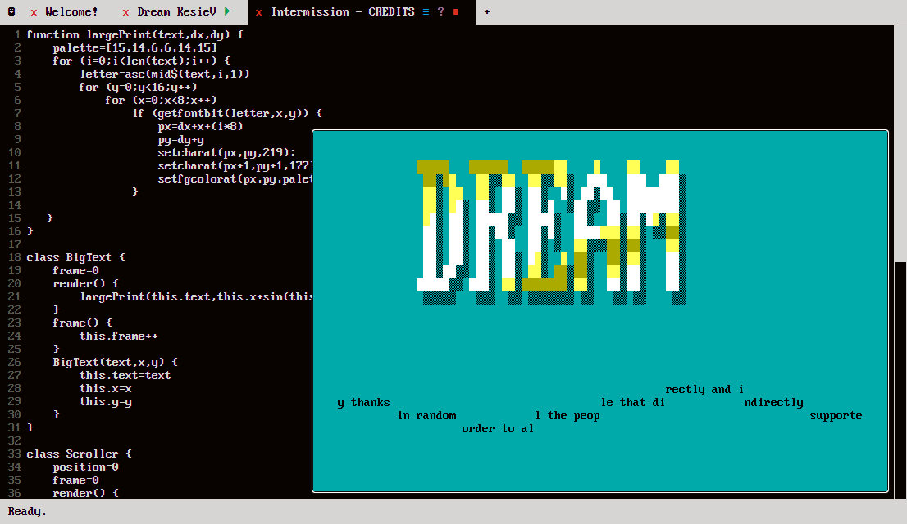
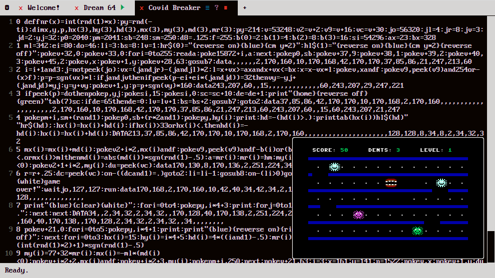
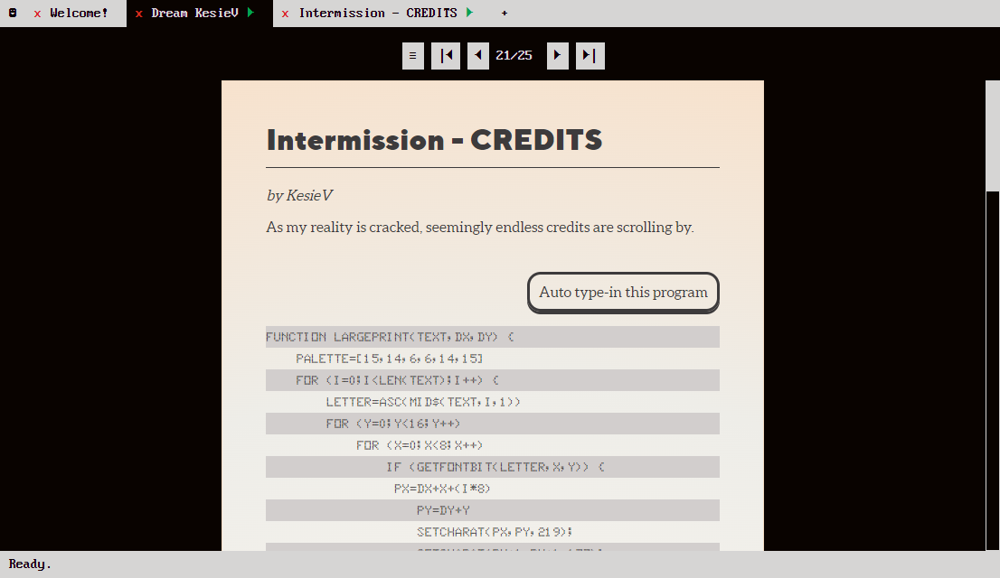

# Programmino

    

---

    <a href="https://www.kesiev.com/programmino/">Start Programmino</a> 
    <i>(Best with keyboard and mouse)</i>

---

**Programmino** is an experimental Fantasy Computer that **simulates multiple features from different real-life retro computers and coding styles/syntaxes from different languages at the same time**. Features can be picked and mixed by single programs, so valid Programmino programs may look like tidy and coherent regular code, obscure blocks of abbreviations, or crazy irregular pastiches of clashing stuff from different standards and machines. The same may happen when executed - you decide. **It tries to implement a dream** of floating chunks of unrecognizable code, unreadable walls of text, and pulsating lo-res graphics I had in the last weeks of December 2021.

    

    INTERMISSION - Credits for Programmino by KesieV

    

    <a href="https://gkanold.wixsite.com/homeputerium/games-list-2020">Covid Breaker</a> for Commodore 64 BASIC by Davide Fichera (Naufr4g0 of Phaze101)

You can read more about Programmino in built-in magazines:

    

## News and contacts

I use [Twitter](https://twitter.com/kesiev) as my main social. It's probably the best place to be updated about Programmino and to contact me.

## Credits

  * Programmino is Open Source and MIT/GPL2 licensed
  * Programmino IDE uses [CodeMirror 5](https://codemirror.net/) text editor
  * Programmino IDE heavily uses the [IBM VGA 8x16 font](https://int10h.org/oldschool-pc-fonts/fontlist/font?ibm_vga_8x16)
  * Magazines are using Aleo, TTNorms-black, Young Serif, and KeyPunch029 fonts
  * More credits in magazines

## Thanks

  * [Bianca](http://www.linearkey.net/)
  * Phab!
  * Morpheus
